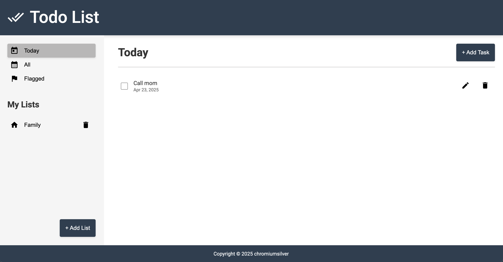

# Todo List Application

A clean, modern Todo List application built with JavaScript following MVC architecture.

## Live Demo

Try the application live [here](https://chromiumsilver.github.io/todo-list/) 👈🏻

## Features

- Create, edit, and delete tasks
- Organize tasks into custom lists
- Filter tasks by today, all, or flagged status
- Mark tasks as complete
- Set due dates for tasks
- Add notes to tasks
- Flag important tasks
- Set task priority (low, normal, high)
- Local storage persistence

## Architecture

This application is built following the Model-View-Controller (MVC) architectural pattern with additional patterns to ensure clean code structure.

### Key Components

- **Models**: Define the data structure and entity behavior
  - `Task`: Represents a todo item with properties and methods
  - `TaskList`: Represents a collection container for tasks

- **Views**: Handle UI rendering and user interactions
  - `TaskView`: Displays tasks and handles task-related interactions
  - `ListView`: Displays lists and handles list-related interactions
  - `TaskFormView`: Manages the task form modal
  - `ListFormView`: Manages the list form modal

- **Controllers**: Implement business logic and coordinate between models and views
  - `TaskController`: Manages task operations
  - `ListController`: Manages list operations
  - `AppController`: Main controller that coordinates the application

- **Data Layer**:
  - `DataStore`: Repository for data management
  - `StorageService`: Interface for storage operations
  - `LocalStorageService`: Implementation of storage using browser's localStorage

- **Utils**:
  - `EventBus`: Handles communication between components using the publish-subscribe pattern

## Acknowledgments

- Icons from Material Icons
- Date handling with date-fns
- Built with Webpack 